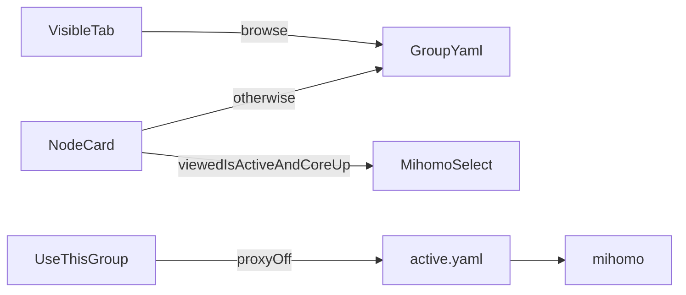

# 首页和多配置

依据 [docs/home-and-groups.md](docs/home-and-groups.md)。参考本机 `/tmp/v2rayNG` 的 `6fe3893`：`MainTopBar.kt`、`MainDrawer.kt`、`MainImportMenu.kt`、`MainGroupTab.kt`、`MainServerPager.kt`。不搬 Compose。第 16 天不开始。助手和界面一起改，版本升到 `0.1.17`。

当前导入会写成唯一的候选文件再整份激活，见 [daemon/internal/profile/store.go](daemon/internal/profile/store.go) 的 `ImportURL` / `Activate`。首页右上角三个入口在 [app/qml/Main.qml](app/qml/Main.qml) 的 `homePage`。节点选择只在核心运行时走 [daemon/internal/api/groups.go](daemon/internal/api/groups.go)，核心停着会 409。

## 1. 分组存储

在应用数据目录下为每组建一个目录，文件仍是 root `0600`。组记录编号、显示名、种类（`subscription` 或 `manual`）。订阅地址单独放在该组目录，列表接口不返回地址。

- 一条分享链接追加到「默认」组，其他组不动。
- 一份 Clash 文档或订阅链接新建一组。同一地址再次导入只刷新那一组。
- 校验失败不改该组，也不改正在使用的组。
- 手机上已有的 `active.yaml` 在助手启动时迁成第一组，不丢掉。
- 换正在使用的组必须先关代理。成功后才替换 `active.yaml` 和 `last-good.yaml`。滑 tab 只改界面上正在看的组。

点节点时：正在看的组就是正在使用的组，且核心在跑，则沿用第 9 天的选择接口，并写回该组文档里对应代理组的 `now`。否则只改文档里的 `now`，不碰核心。Clash 订阅的规则和其他代理组保留。手工组只有一个节点时，运行配置是该节点加上第 13 天选中的规则模板。

开发机测试：第二条导入不覆盖第一条；坏文本不替换已有组；列表和错误里没有订阅地址、密码、UUID、Reality 材料；代理开着时切换正在使用的组被拒绝。

## 2. 助手接口

现有 `/v1/profiles/import-*`、`activate`、`refresh`、`document`、`edit` 改为带组编号，或在旁边加组接口并把旧路径转成「当前正在使用的组」，避免编辑和规则模板还指向一份隐式文件。

需要的操作：列出组（名称、种类、节点数、是否正在使用）、列出一组节点（名称、类型、网络、延迟、是否选中、能否导出成分享链接）、导入、刷新一组、使用一组、删除一组、删除一个节点、测一个节点、后台测当前组全部节点、按组读写文档和规则模板。

全部延迟不能在界面线程里逐个等待。第 14 天的 `Controller::request` 会堵住界面。助手在后台测，界面只读进度和结果。导出文本由界面放进剪贴板，不写进日志。

## 3. 首页组件

[app/qml/Main.qml](app/qml/Main.qml) 已经超过一千行。新界面拆到 `app/qml/` 并写进 [app/qml/qml.qrc](app/qml/qml.qrc)，`Main.qml` 只保留认证、扫码和页面栈。节点用 `ListView`，不要用 `Column` 里的 `Repeater` 把 64 条一次建完。

顶栏，对应 `MainTopBar`：

- 左侧 `navigationActions` 放三道杠。侧面是盖在页面栈上的面板，宽度约屏幕的四分之三，点外面关闭。Lomiri 1.3 没有现成的 NavigationDrawer，用页面上的遮罩和列，不引入 Android 控件。
- 右侧三个按钮。搜索按下后，标题换成输入框，只按当前组的节点名过滤；再按一次清空并恢复标题。源码里这是搜索，不是另一套筛选。
- 添加和更多用已有的 `Lomiri.Components.Popups`，从按钮旁弹出。添加项：剪贴板、二维码（现有相册和相机）、订阅链接、本地 YAML，以及 `ss`、`vmess`、`vless`、`trojan`、Hysteria2、TUIC。不做 SOCKS、HTTP、WireGuard、策略组、链式代理的手工表单。
- 更多项：重启代理、删除当前组里的节点（先确认）、导出当前组里能还原的分享链接、测试当前组延迟、刷新当前订阅。刷新只对订阅组可点。删除和导出不把正文写入日志。按延迟排序和定位当前节点这次不做。

分组条，对应 `GroupTabBar`：横向列表，文字是「组名 (数量)」。正在使用的组加标记。只有一组时不显示这条。左右滑内容区切换正在看的组，不调用「使用本组」。正在看的组不是正在使用的组时，显示「使用本组」；代理开着时显示「请先关闭代理」并不执行。

节点横条，对应 `ServerListItem`：左侧选中条，名称，类型和网络，延迟。右侧是测延迟、编辑、删除。能还原成分享链接时才显示分享。编辑打开现有的单节点表单，并带上组编号。删除只去掉这一条，并改掉代理组里指向它的名字。

底栏留在首页，不放进抽屉：总开关、本次上传和下载、累计、速率和图。图仍只在有采样时出现。

## 4. 侧面菜单里的旧页面

抽屉四项，都是压进现有页面栈，不再从首页右上角进入：

- 订阅分组：每组的名称、刷新、删除整组。地址只在这一页编辑，不进首页列表。
- 规则模板：搬 [app/qml/Main.qml](app/qml/Main.qml) 里 `profilePage` 的三个按钮。作用对象是正在看的组。这一组正在被核心使用时，代理开着不能改。
- 配置编辑：现有 `editorPage` 的按行编辑器，打开的是正在看的组。保存仍先过 `mihomo -t`，失败不替换该组。
- 日志和当前连接：现有 `sessionPage`。

`nodePage` 的分组列表不再作为首页入口。选节点改由首页横条完成。IPv6、kill switch、局域网、核心升级、关于、按 UID 分流这次不加进抽屉。

## 5. 安装和核对

开发机测试通过后编译安装 `0.1.17`。正在运行的旧助手需要在手机上结束后再打开。核对：旧订阅还在并成为一组；再导入一条分享链接出现第二个 tab，第一组还在；滑 tab 不换正在运行的配置；代理开着不能使用另一组；关掉后可以换；卡片和日志里没有密钥。核对通过后再开始第 16 天。
